# Edit Anything by Segment-Anything

[](https://huggingface.co/spaces/shgao/EditAnything)

This is an ongoing project aims to **Edit and Generate Anything** in an image,
powered by [Segment Anything](https://github.com/facebookresearch/segment-anything), [ControlNet](https://github.com/lllyasviel/ControlNet),
[BLIP2](https://github.com/salesforce/LAVIS/tree/main/projects/blip2), [Stable Diffusion](https://huggingface.co/spaces/stabilityai/stable-diffusion), etc.

Any forms of contribution and suggestion
are very welcomed!

# News🔥
2023/08/09 - Revise UI and code, fixed multiple known issues.

2023/07/25 - EditAnything is accepted by the ACM MM demo track.

2023/06/09 - Support cross-image region drag and merge, unleash creative fusion!

2023/05/24 - Support multiple high-quality character editing: clothes, haircut, colored contact lenses.

2023/05/22 - Support sketch to image by adjusting mask align strength in `sketch2image.py`!

2023/05/13 - Support interactive segmentation with click operation!  

2023/05/11 - Support tile model for detail refinement!

2023/05/04 - New demos of Beauty/Handsome Edit/Generation is released!

2023/05/04 - ControlNet-based inpainting model on any lora model is supported now. EditAnything can operate on any base/lord models without the requirements of inpainting model.

<details>
  <summary> More update logs. </summary>

    
2023/05/01 - Models V0.4 based on Stable Diffusion 1.5/2.1 are released. New models are trained with more data and iterations.[Model Zoo](https://github.com/sail-sg/EditAnything#model-zoo)

2023/04/20 - We support the Customized editing with DreamBooth.

2023/04/17 - We support the SAM mask to semantic segmentation mask.

2023/04/17 - We support different alignment degrees bettween edited parts and the SAM mask, check it out on [DEMO](https://huggingface.co/spaces/shgao/EditAnything)!

2023/04/15 - [Gradio demo on Huggingface](https://huggingface.co/spaces/shgao/EditAnything) is released!

2023/04/14 - New model trained with LAION dataset is released.

2023/04/13 - Support pretrained model auto downloading and gradio in `sam2image.py`.

2023/04/12 - An initial version of text-guided edit-anything is in `sam2groundingdino_edit.py`(object-level) and `sam2vlpart_edit.py`(part-level).

2023/04/10 - An initial version of edit-anything is in `sam2edit.py`.

2023/04/10 - We transfer the pretrained model into diffusers style, the pretrained model is auto loaded when using `sam2image_diffuser.py`. Now you can combine our pretrained model with different base models easily!

</details>

2023/04/09 - We released a pretrained model of StableDiffusion based ControlNet that generate images conditioned by SAM segmentation.

# Features

**Try our [](https://huggingface.co/spaces/shgao/EditAnything)🔥🔥🔥**
## Unleash creative fusion: Cross-image region drag and merge!🔥


## Clothes editing!🔥


## Haircut editing!🔥


## Colored contact lenses!🔥


## Human replacement with tile refinement!🔥


## Draw your Sketch and Generate your Image!🔥
prompt: "a paint of  a  tree in the ground with a river."
<div>
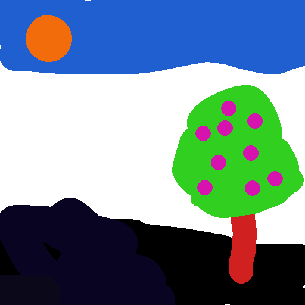
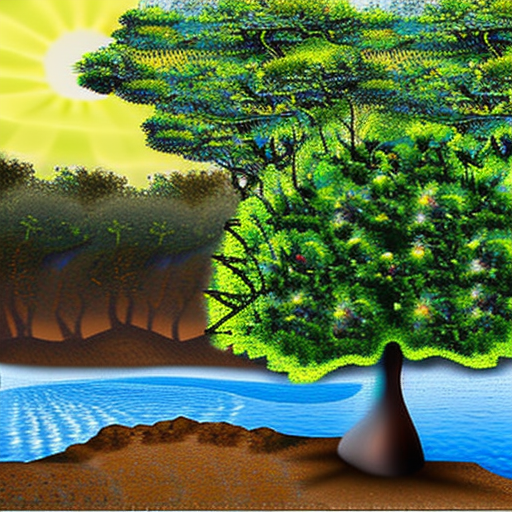
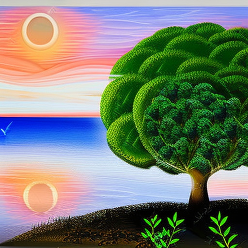
</div>

<details>
  <summary> More demos. </summary>

prompt: "a paint, river, mountain, sun, cloud, beautiful field."
<div>
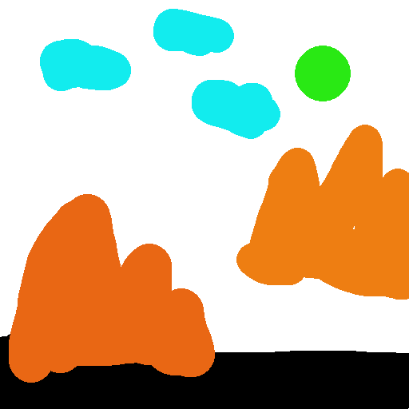


</div>

prompt: "a man, midsplit center parting hair, HD."
<div>

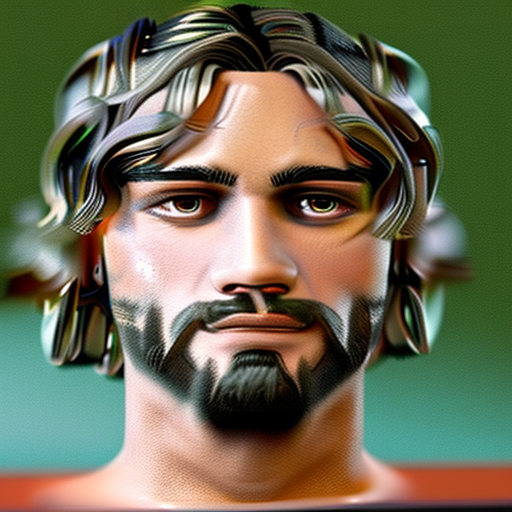
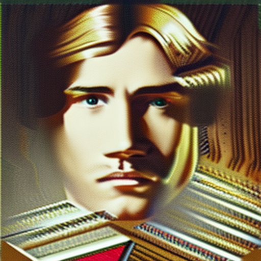
</div>

prompt: "a woman, long hair, detailed facial details, photorealistic, HD, beautiful face, solo, candle, brown hair, blue eye."
<div>
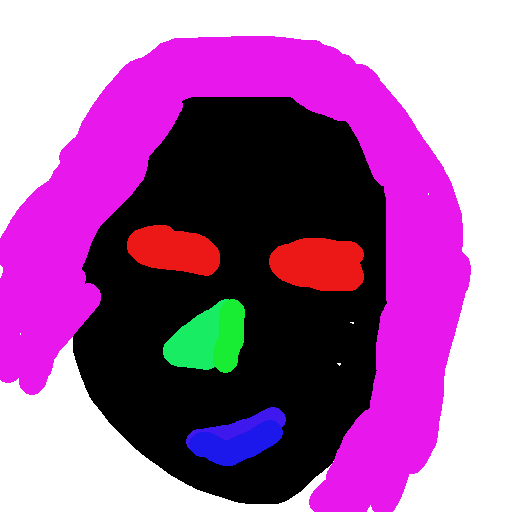
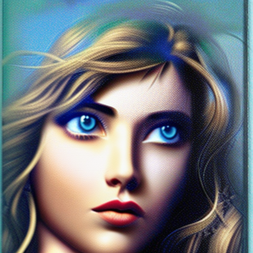

</div>
</details>

Also, you could use the generated image and sam model to refine your sketch definitely!

## Generate/Edit your beauty!!!🔥🔥🔥
**Edit Your beauty and Generate Your beauty**
<div>
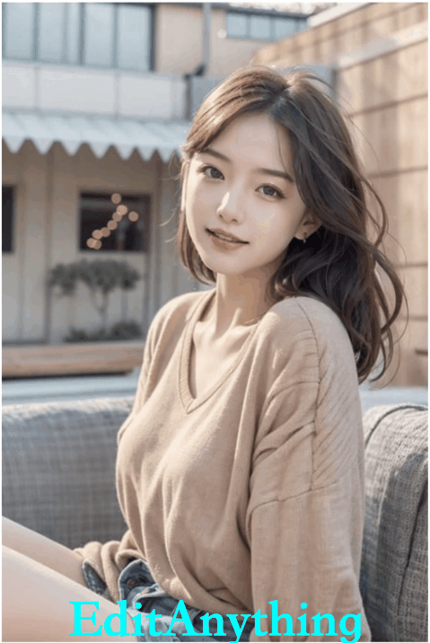
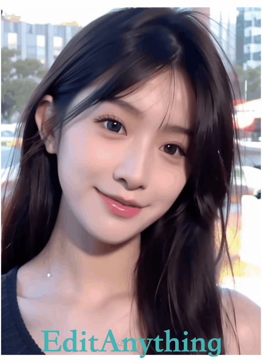
</div>


## Customized editing with layout alignment control.

EditAnything+DreamBooth: Train a customized DreamBooth Model with `tools/train_dreambooth_inpaint.py` and replace the base model in `sam2edit.py` with the trained model.

## Image Editing with layout alignment control.


## Keep the layout and Generate your season!
<div>
    
    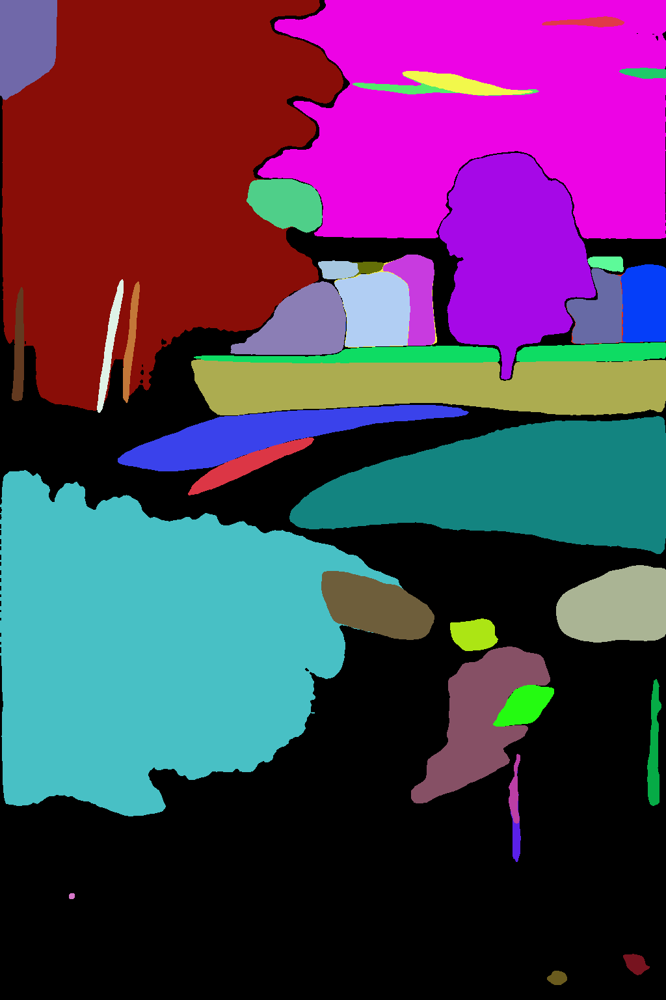
</div>

Human Prompt: "A paint of spring/summer/autumn/winter field."
<div>
    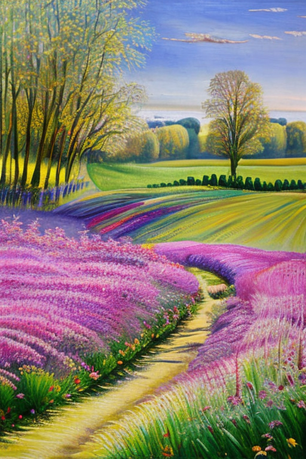
    
    
    
</div>

## Edit Specific Thing by Text-Grounding and Segment-Anything
### Editing by Text-guided Part Mask
Text Grounding: "dog head"

Human Prompt: "cute dog"
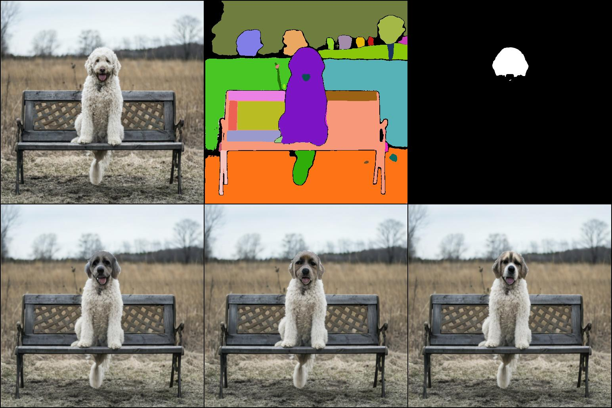

<details>
  <summary> More demos. </summary>
    
Text Grounding: "cat eye"

Human Prompt: "A cute small humanoid cat"
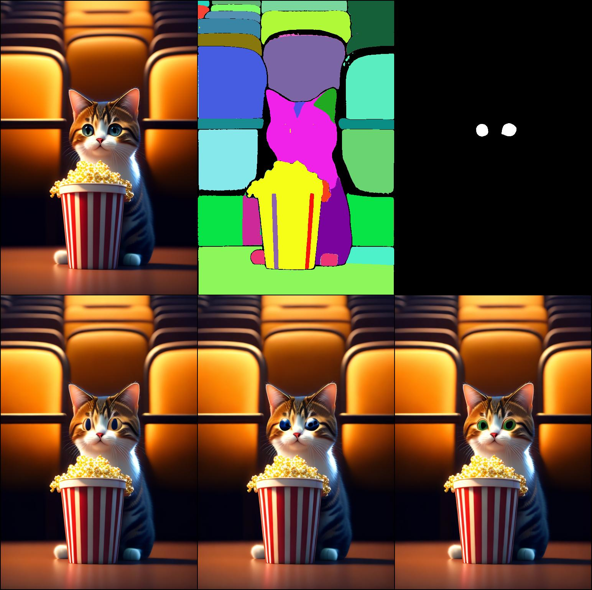
    
</details>

### Editing by Text-guided Object Mask
Text Grounding: "bench"

Human Prompt: "bench" 
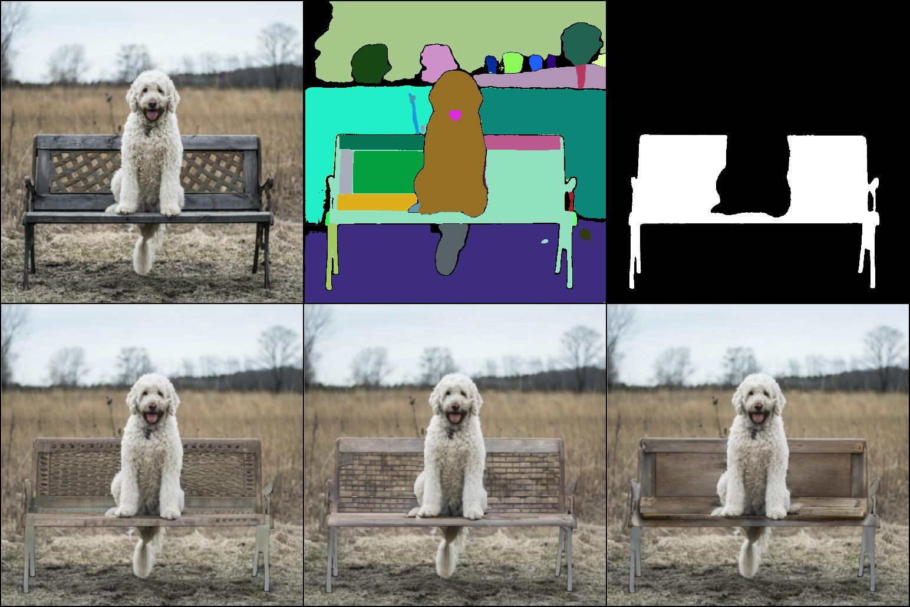

## Edit Anything by Segment-Anything

Human Prompt: "esplendent sunset sky, red brick wall"
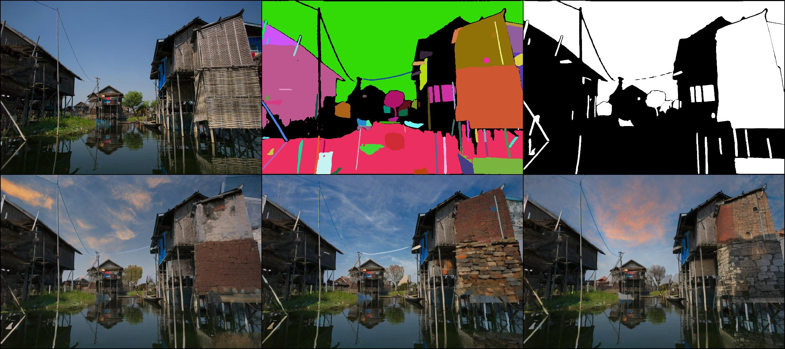


<details>
  <summary> More demos. </summary>
    
Human Prompt: "chairs by the lake, sunny day, spring"
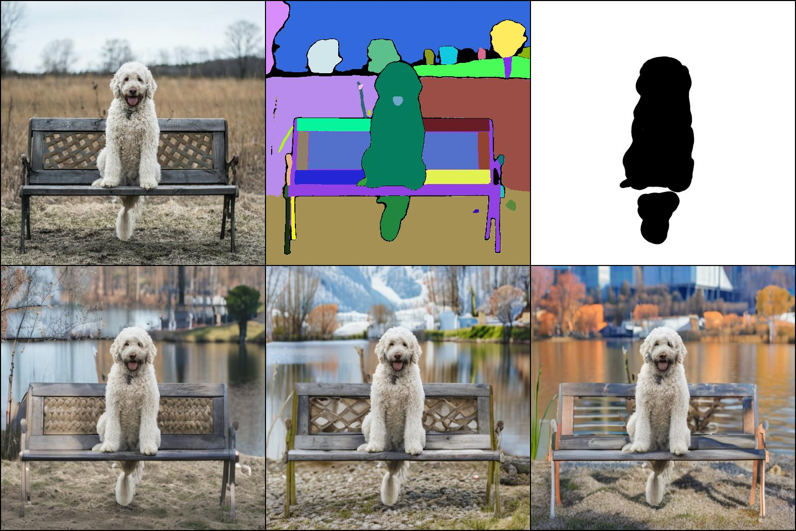
    
</details>


## Generate Anything by Segment-Anything

BLIP2 Prompt: "a large white and red ferry"
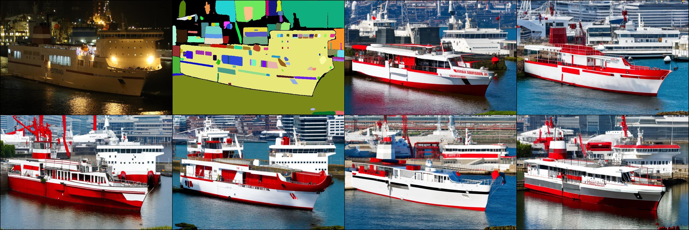
(1:input image; 2: segmentation mask; 3-8: generated images.)

<details>
  <summary> More demos. </summary>

BLIP2 Prompt: "a cloudy sky"
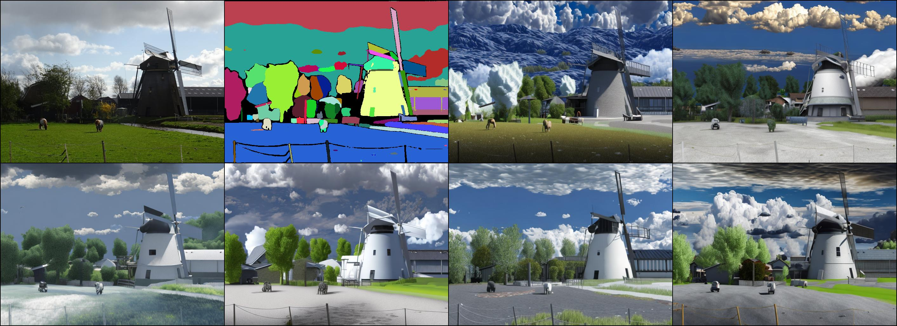

BLIP2 Prompt: "a black drone flying in the blue sky"
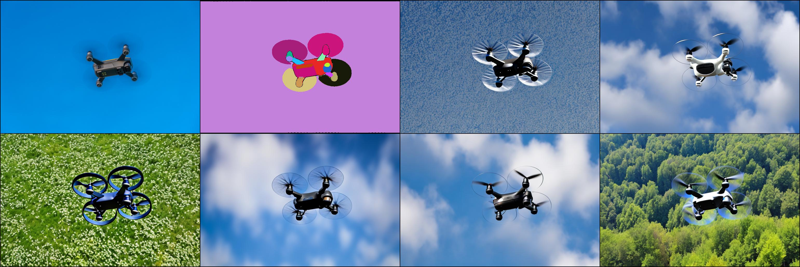

 </details>

1) The human prompt and BLIP2 generated prompt build the text instruction.
2) The SAM model segment the input image to generate segmentation mask without category.
3) The segmentation mask and text instruction guide the image generation.

## Generate semantic labels for each SAM mask.
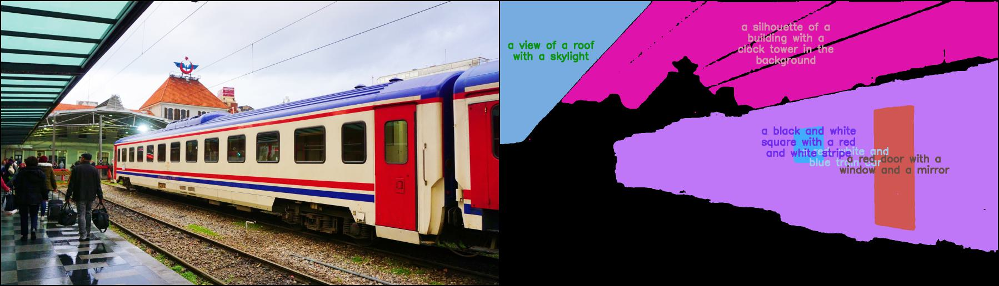
```
python sam2semantic.py

```

Highlight features:
- Pretrained ControlNet with SAM mask as condition enables the image generation with fine-grained control.
- category-unrelated SAM mask enables more forms of editing and generation.
- BLIP2 text generation enables text guidance-free control.

# Setup

**Create a environment**

```bash
    conda env create -f environment.yaml
    conda activate control
```

**Install BLIP2 and SAM**

Put these models in `models` folder.
```bash
# BLIP2 and SAM will be audo installed by running app.py
pip install git+https://github.com/huggingface/transformers.git

pip install git+https://github.com/facebookresearch/segment-anything.git

# For text-guided editing
pip install git+https://github.com/openai/CLIP.git

pip install git+https://github.com/facebookresearch/detectron2.git

pip install git+https://github.com/IDEA-Research/GroundingDINO.git
```

**Download pretrained model**
```bash

# Segment-anything ViT-H SAM model will be auto downloaded. 

# BLIP2 model will be auto downloaded.

# Part Grounding Swin-Base Model.
wget https://github.com/Cheems-Seminar/segment-anything-and-name-it/releases/download/v1.0/swinbase_part_0a0000.pth

# Grounding DINO Model.
wget https://github.com/IDEA-Research/GroundingDINO/releases/download/v0.1.0-alpha2/groundingdino_swinb_cogcoor.pth

# Get pretrained model from huggingface. 
# No need to download this! But please install safetensors for reading the ckpt.

```


**Run Demo**
```bash
python app.py
# or
python editany.py
# or
python sam2image.py
# or
python sam2vlpart_edit.py
# or
python sam2groundingdino_edit.py
```


# Model Zoo

| Model | Features | Download Path |
|-------|----------|---------------|
|SAM Pretrained(v0-1) | Good Nature Sense | [shgao/edit-anything-v0-1-1](https://huggingface.co/shgao/edit-anything-v0-1-1) |
|LAION Pretrained(v0-3) | Good Face        | [shgao/edit-anything-v0-3](https://huggingface.co/shgao/edit-anything-v0-3)
|LAION Pretrained(v0-4) | Support StableDiffusion 1.5/2.1, More training data and iterations, Good Face        | [shgao/edit-anything-v0-4-sd15](https://huggingface.co/shgao/edit-anything-v0-4-sd15) [shgao/edit-anything-v0-4-sd21](https://huggingface.co/shgao/edit-anything-v0-4-sd21)


# Training

1. Generate training dataset with `dataset_build.py`.
2. Transfer stable-diffusion model with `tool_add_control_sd21.py`.
2. Train model with `sam_train_sd21.py`.


# Acknowledgement
```
@InProceedings{gao2023editanything,
  author = {Gao, Shanghua and Lin, Zhijie and Xie, Xingyu and Zhou, Pan and Cheng, Ming-Ming and Yan, Shuicheng},
  title = {EditAnything: Empowering Unparalleled Flexibility in Image Editing and Generation},
  booktitle = {Proceedings of the 31st ACM International Conference on Multimedia, Demo track},
  year = {2023},
}
```

This project is based on:

[Segment Anything](https://github.com/facebookresearch/segment-anything),
[ControlNet](https://github.com/lllyasviel/ControlNet),
[BLIP2](https://github.com/salesforce/LAVIS/tree/main/projects/blip2),
[MDT](https://github.com/sail-sg/MDT),
[Stable Diffusion](https://huggingface.co/spaces/stabilityai/stable-diffusion),
[Large-scale Unsupervised Semantic Segmentation](https://github.com/LUSSeg),
[Grounded Segment Anything: From Objects to Parts](https://github.com/Cheems-Seminar/segment-anything-and-name-it),
[Grounded-Segment-Anything](https://github.com/IDEA-Research/Grounded-Segment-Anything)

Thanks for these amazing projects!
